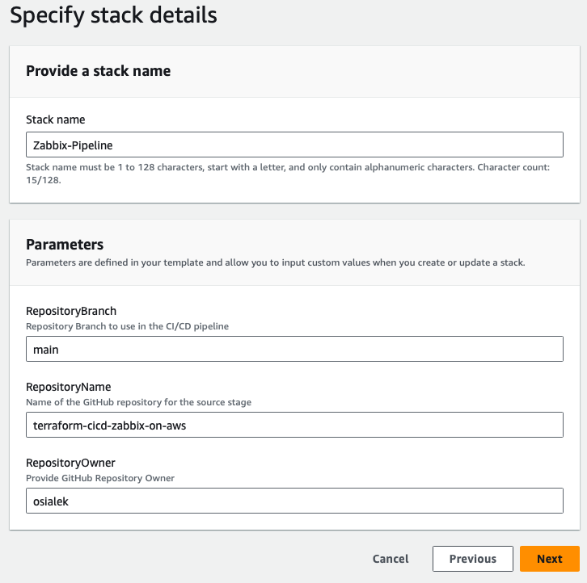

# terraform-cicd-zabbix-on-aws
Zabbix monitoring solution deployment with Terraform and CodePipeline on AWS.

- [terraform-cicd-zabbix-on-aws](#terraform-cicd-zabbix-on-aws)
- [Introduction](#introduction)
  - [Zabbix Solution availability in AWS Marketplace](#zabbix-solution-availability-in-aws-marketplace)
- [Project Goals](#project-goals)
- [Architecture](#architecture)
  - [Terraform \& Terragrunt](#terraform--terragrunt)
  - [CI/CD Pipeline](#cicd-pipeline)
    - [CI/CD Pipeline Design:](#cicd-pipeline-design)
- [Getting Started](#getting-started)
  - [Prerequisites](#prerequisites)
  - [Installation](#installation)
- [Potential enhancements](#potential-enhancements)
  - [Notes](#notes)


# Introduction
This documentation will not go into details about what the Zabbix is. Find out more on their [webiste](https://www.zabbix.com).

## Zabbix Solution availability in AWS Marketplace
Zabbix can be deployed on AWS from [AWS Marketplace](https://aws.amazon.com/marketplace/seller-profile?id=2165f7b5-56be-4d2b-a65a-51c6d8d4ac09&ref=dtl_prodview-7zl2s7qk7lgxe).

There are currently 9 products offered by Zabbix on AWS Marketplace. -*02/05/2024*

Zabbix Server 6.0 on AWS Marketplace provides a Zabbix server deployment on EC2 instances. Recommended EC2 instance type is t2.medium.
This product offers a pre-configured zabbix server on a EC2 instance (instance type and zabbix version can be changed) with our customizations on the security group, key pairs and obviously the AWS region.

# Project Goals

What we want to achieve in this project is a **landing-zone on AWS built with Terraform and CodePipeline** and on top of that a **Zabbix** for monitoring resources on AWS. The total environment will cover:

CI/CD:

- Separate network for CodeBuild resources
- CI/CD Pipeline
  - with Source from CodeCommit or GitHub
  - 3 CodeBuild stages
  - 1 Manual Approval stage

Environment:

- Single VPC
- 2 subnets (1x public, 1x private)
- NAT Gateway, Internet Gateway
- Network ACLs
- Security Groups
- Zabbix Server deployment (within provisioned EC2 instance with Terraform)
- User-Data script for Zabbix Server configuration
- User-Data script for ec2 instances with Zabbix Agent configuration

Optionally there is a script, which can be used on target Ubuntu servers to setup Zabbix Agent prior to monitoring setup.
- Ubuntu Agent setup Script
- One instance is deployed within this configuration files for testing purposes with applied script (user-data)

Ideally a Golden Image with preconfigured Zabbix agent and its configuration should be created for batch deployments or Image Builder in AWS could be use for this purpose.

# Architecture

The base environment configuration comes with a VPC and its CIDR set to 10.0.0.0/16 and two subnets, public 10.0.100.0/24 and private 10.0.0.0/24. **All these CIDRs are parametarized in the Terraform config files** and can be set either in the variables file, tfvars, -var CLI flag or in the Terragrunt file configuration.


The architecture provides a public subnet with both NAT Gateway and the Internet Gateway for the network accessibility and a bastion host. Desktop bastion host will be a jump host for accessing private resources in the AWS Cloud **including the Zabbix Server**. Zabbix Server is hosted in the private subnet together with its monitored resources (but it can access resources in the public subnet too!).

## Terraform & Terragrunt

This solution provides an infrastructure in AWS, a Landing Zone for your workload with pre-configured Zabbix Server (configured during deployment - precisely speaking). This is deployed as IAC (infrastructure as code) with Terraform custom module called zabbix. All terraform configuration files can be found in Modules/zabbix directory.

Additionally, instead of a standard deployment with Terraform, a Terragrunt has been introduced to provide a capability of splitting the environments and split Terraform deployments per different config to maximize DRY. Further development of this solution could provide a split in deployment if there would be more than one enviornment or region. We could use Terragrunt to easily split deployments and add that in the pipeline as separate stages for example. This configuration presents example where for both prod and dev the same account is used but deployment targets are in different regions.

## CI/CD Pipeline

This solution comes with a CI/CD pipeline developed in AWS CodePipeline. The pipeline deployment is automated with AWS IAC solution - CloudFormation. With one template you can provision all resources required for the CI/CD to work. Parameters required for CI/CD are:

- RepositoryName - Name of the GitHub repository for the source stage
- RepositoryOwner - Provide GitHub Repository Owner
- RepositoryBranch - Repository Branch to use in the CI/CD pipeline

All these parameters refer to the repository where your code will be stored, since there are customizations required in the terragrunt hcl files, it's required to have a copy repo of this with your customized configuration. Details are described below in the installation manual. CI/CD requires also 3 secrets in Secrets Manager, which is also documented below.

### CI/CD Pipeline Design:


# Getting Started

## Prerequisites

Local packages:

- Terraform >= 1.8.2
- Terragrunt >= 0.57.13 <--- *Optional but recommended*
- AWS CLI >= 2.15.34
- AWS CLI authentication:
  - profiles saved in ~/.aws/credentials
  - exported ACCESS KEYS in the console
  - ACCESS KEYS in Vault
  - or other

Although if you do it with the CI/CD pipeline, you dont need to set it up on your PC. It will be automatically set up on the build machines, running in the CI/CD pipeline.

On AWS:

- Access keys Secrets stored in secrets named:
  - /terraform/dev/AWS_ACCESS_KEY_ID
  - /terraform/dev/AWS_SECRET_ACCESS_KEY
- GitHub Token Secret (if GitHub is used for Source) named:
  - terraform/githubToken

## Installation

1. Clone this repository to your own repo so you can customize the environment for you needs.
   
  - This change is required for S3 Bucket change for the Terraform Backend Configuration in the terragrunt.hcl files:
  ```js
  config = {
      // Configure your own S3 Bucket
      bucket         = "BUCKET NAME"     
      // tf state file location - change if you need
      key            = "${path_relative_to_include()}/terraform.tfstate"
      // change the region for deployment targer region if required 
      region         = "eu-central-1" 
    }
  ```
  - You can also change the backend type and/or add DynamoDB table for state locking.
  - Backend configuration in the Terragrunt hcl files is important for the CodeBuild to work.
  - Read Terragrunt/Terraform documentation if necessary for reference.
  - Save your repo owner name and repo name for pipeline configuration (source).
  
2. Download the [Cloudformation template](./codePipeline.yaml) from this repo.
3. Create a Secret in Secrets Manager with your GitHub Token as a Value (unless you want to use CodeCommit, then you can skip adding that secret but you will have to change codePipeline template according to the comments within it). Secret name should be as followed:
   - /terraform/githubToken
4. Create Secrets in Secrets Manager with your AWS Access Keys. With secrets name accordingly:
   - /terraform/dev/AWS_ACCESS_KEY_ID
   - /terraform/dev/AWS_SECRET_ACCESS_KEY
5. Launch the CloudFormation template in your AWS Account
   - Name your stack as you'd like to easily identify it in CloudFormation
   - Fill in necessary parameters (repo where your customized code is or CodeCommit AWS based repository), example with GitHub as a repo:
    
6. Proceed with CloudFormation stack further (next, next, next...) + accept that stack might provide IAM resources.
7. Voila! - Your enviornment is ready. Now the CI/CD pipeline will run for the first time after it's provisioning, but don't worry, there is a Manual Approval required to deploy any resources with Terragrunt. Feel free to modify the config files available in this repo.
 
# Potential enhancements

This solution is a POC, but is solid and should work fine even in production. However, in future cycles of this solution development the following enhancements could be done:

- implement GitHub webhooks with your org/personal repositories where the code is. Current solution makes CodePipeline look for the changes in the repo, which is not recommended by AWS.
- enhance the pipeline with terragrunt different enviornments/targets per demand
- introduce High Availability:
  - multi-az network with public & private subnets in at least 2 AZs
  - zabbix servers deployment in Auto Scaling Group with subnets in at least 2 AZs
    - this would require more work in the user-data scripts or change in the deployment approach
- create golden images or automation for agents installation on target systems
  - for example if organization uses only specific operation systems, create an image builder with preconfigured zabbix agents installed on it
  - create an automation with step function in AWS, per tag on for example EC2, step function will trigger a set of functions to provide an agent and onboard EC2 to Zabbix
  - use user-data script defined in terraform configuration for all EC2 instances
- enhance user-data variables' security - use ssm or vault
  - however, the initial credentials for Zabbix should be changed after configuration by admin/user anyway.
- SSH key pair is getting generated on the build machine during the CICD pipeline activities (apply). There could be a script implemented to upload the key to git repository or somewhere else (s3, etc...), to reuse the key if necessary.

## Notes

- Deployed Zabbix server is running on the latest Ubuntu 22.04 image available in the AWS AMI Catalog
- Initial credentials for Zabbix are available in the user-data script: /Modules/zabbix/user-data/zabbix-user-data.sh *They can be replaced or changed after initial configuration.*
  - DB_USER="zabbix"
  - DB_USER_PASSWORD="password"

